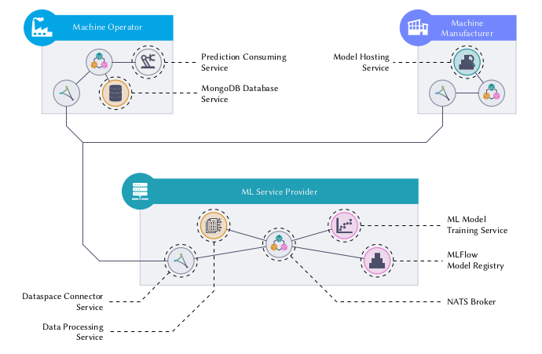

% Openhub-Demo documentation master file, created by
% sphinx-quickstart on Tue May  6 12:05:35 2025.
% You can adapt this file completely to your liking, but it should at least
% contain the root `toctree` directive..

# Openhub-Demo Documentation


## About The Project
**Machine Learning Lifecycle Management Using Dataspaces for Optimized Machine Parameterization in Recycled Plastic Packaging**

This project demonstrates a distributed, dataspace-enabled architecture for optimizing thermoforming machine parameters (temperature, pressure, cycle time) using machine learning. 
It involves three key participants: a machine manufacturer, a plastic packaging producer (machine operator), and an ML service provider. 
Operators share labeled data—including material properties and machine settings—via secure dataspace connectors. 
The ML service provider processes this data and trains regression models using PyTorch, managing the model lifecycle with MLflow. 
These models are then deployed by the machine manufacturer as a value-added service. 
The architecture leverages the FastIoT microservice framework and NATS messaging for scalable, containerized communication. 
This setup enables secure data sharing, specialization across roles, and efficient, continuous model retraining and deployment in real industrial environments.

This Demonstration is part of the research project [KIOptipack](https://ki-hub-kunststoffverpackungen.de/ki-opti-pack/ueber) funded by the German Federal Ministry of Education and Research (BMBF).
The demonstrator showcases how to realise a minimalistic version the proposed architecture in the project.
Please note that in this implementation, dataspaces are not fully implemented. In Particular only the data-plane is implemented, contract management is not implemented. 
We aim to realise a full implementation of the architecture towards the end of the project (End of 2025).
For futer developments of the Dataspace connector please check out the [Eclipse Dataspace](https://projects.eclipse.org/working-group/eclipse-dataspace) project.

This demonstrator focuses on showcases how model lifecycle management can be realised using the [FastIOT](https://github.com/FraunhoferIVV/fastiot) framework, which is used in the project to connect machines as microservices.
This Repository is supplementary material for the technical communication  "Machine Learning Lifecycle Management Using Dataspaces for Optimized Machine Parameterization in Recycled Plastic Packaging".
Below you can find a figure of the architecture of the demonstrator. 



Please have a look at the publication for more details on the architecture and the implementation. 
This Demonstrator was originally showcased at the [Open Hub Days 2024](https://gi.de/veranstaltung/open-hub-days) in Dresden, Germany. 
Together with a first version of the Dataspace Connector incoperated into the FastIoT System, which is not yet publicly available.

## Datastructures

The dataset contains labeled datapoints related to material validation processes for thermoforming equipment. Each datapoint reflects a specific use case or validation scenario, including information on the material used, equipment configuration, validation method, and outcome.

Thermoforming machine manufacturers typically offer a predefined material portfolio aligned with their equipment specifications. Converters can select suitable materials based on the intended application. To ensure contractual performance targets are met, manufacturers validate the machine's efficiency using standard materials. Using alternative materials is generally at the converter's own risk. However, some manufacturers support formal validation of unapproved materials—either through practical testing on identical or comparable machines or via structured methods such as Design of Experiments (DOE). These validation processes are typically completed within one day based on prior experience.

Each datapoint captures the relevant parameters and results from these validation efforts.

```python
    {
        "ListeKomponenten": ["K000055", "K000057"], # List of materials (id or material name)
        "Massenanteile": [0.5, 0.5],  # mass ratios of the materials (unit: g/g)
        "Flächenanteilmodifiziert": 0,  # modified surface (unit: %)
        "Geometrie": "Quader",  # geometry (unit: list of types)
        "Kopfraumatmosphäre": None,  # headspace atmosphere (unit: Pa)
        "Masse": None,  # mass (unit: g)
        "Verpackungstyp": "Folie",  # packaging type
        "CAD": None,  # link to CAD file
        "RauheitRa": 0.08666666666666667,  # roughness Ra (unit: µm)
        "RauheitRz": 0.924,  # roughness Rz (unit: µm)
        "Trübung": 216.1,  # haze (unit: HLog)
        "Glanz": 36.7,  # gloss (unit: GE)
        "Dicke": 738.6666666666666,  # thickness (unit: µm)
        "Emodul": 807.9225728004443,  # elastic modulus (unit: MPa)
        "MaximaleZugspannung": 33.22942107172407,  # maximum tensile stress (unit: MPa)
        "MaximaleLängenänderung": 14.57795412214027,  # maximum elongation (unit: %)
        "Ausformung": 1,  # forming process rating  (unit: class (1 to 6))
        "Kaltverfo": 1,  # cold forming rating (unit: class (1 to 3))
        "Temp": 300,  # [LABEL] temperature (unit: °C) 
        "Zeit": 12,  # [LABEL] time (unit: s)
        "Druck": 4.33  # [LABEL] pressure (unit: bar)
    }
```
Temperature (`"Temp"`), time (`"Zeit"`), and pressure (`"Druck"`) are the target variables for the machine learning model.

## License
Distributed under the MIT License. See `LICENSE.txt` for more information.
```{toctree}
:caption: 'Contents:'
:maxdepth: 2

user guide/index
code_docs/index
references/index
```