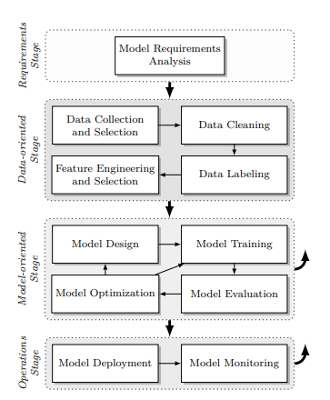

# Background and Related Work
This section contains a summary of the background and related work in the field of machine learning lifecycle management and its application in the context of recycled plastic processing that did not fit into the paper due its page limit.
We added it here for interested readers.

## Machine Parameter Optimization for Recycled Plastic Processing

Recent research has explored the use of machine learning techniques to predict and optimize process parameters.  
<a href="#pelzer2023process">Pelzer et al.</a> have shown that Invertible Neural Networks (INNs) are promising for generating process parameters to achieve desired part properties with high accuracy.  
<a href="#pazhamannil2021prediction">Pazhamannil et al.</a> and <a href="#manoharan2020prediction">Manoharan et al.</a> successfully employed Artificial Neural Networks (ANNs) to predict tensile strength based on various process parameters, demonstrating good agreement with experimental results.  
<a href="#seifert2025development">Seifert et al. (2025)</a> developed an analytical model to predict the shear viscosity of polypropylene compounds, a key parameter for ensuring efficient processing and consistent product quality.  
In a related study, <a href="#seifert2024development">Seifert et al. (2024)</a> proposed an analytical model for predicting the tensile modulus of polypropylene compounds with various fillers and additives. Their work also compared the model’s performance against an artificial neural network, highlighting the strengths and limitations of both approaches.  
Other methodologies for optimizing plastic extrusion processes include artificial neural networks, fuzzy logic, genetic algorithms, and response surface methodology (<a href="#raju2014recent">Raju et al.</a>).  

Overall, it can be stated that the integration of machine learning techniques and analytical models has greatly enhanced the prediction and optimization of process parameters in polymer processing.

## Life Cycle Management for Machine Learning
<a href="#Thopalle2022AUM">Thopalle et al.</a> presents a unified ML approach for artifact management in Jenkins CI/CD pipelines, addressing multiple functions such as retention prediction and compression optimization with a single model.  
<a href="#schlegel2023management">Schlegel and Sattler</a> provide an overview of systems and platforms that support the management of ML artifacts, including datasets, models, and configurations. They establish assessment criteria and apply them to over 60 systems. Additionally, <a href="#schlegel2023management">Schlegel and Sattler</a> define a typical machine learning lifecycle with four stages: the Requirements, Data-oriented, Model-oriented, and Operations-oriented stages.  
The Requirements Stage focuses on defining the functional and technical prerequisites of the ML model, determining the model types and data sources best suited for the given problem. The Data-oriented Stage encompasses data collection, cleaning, labeling, and feature engineering to ensure the availability of high-quality datasets for training. The Model-oriented Stage includes model selection, training, evaluation, and optimization to develop a robust ML model. Finally, the Operations Stage involves model deployment, continuous monitoring, and integration with production systems, ensuring optimal performance and reliability.

Besides the lifecycle model by <a href="#schlegel2023management">Schlegel and Sattler</a>, alternative process models for ML lifecycle management exist.  
<a href="#wirth2000crisp">Wirth and Hipp</a> introduced CRISP-DM (Cross Industry Standard Process for Data Mining), a widely used framework that provides a structured approach to data mining and machine learning projects.  
Another notable extension is <a href="#huber2019dmme">Huber et al.</a>'s DMME (Data Mining Methodology for Engineering Applications), which builds upon CRISP-DM by integrating engineering-specific considerations for a more holistic approach to ML lifecycle management.

Overall, it can be stated that numerous concrete implementations exist for achieving lifecycle management. Effectively realizing an ML lifecycle system corresponds to integrating elements of the process model, such as the lifecycle stages introduced by <a href="#schlegel2023management">Schlegel and Sattler</a>, into a cohesive software architecture.

## Literature Sources

<dl>
   <dt id="abdullah2016optimization">Abdullah et al.</dt>
   <dd>Abdullah, Jamaluddin, Shanb, LWAI, and Ismail, H (2016). “Optimization of injection moulding process parameters for recycled High Density Polyethylene (rHDPE) using the Taguchi method.” Int. J. Mech. Prod. Eng, 4, 76–81.</dd>
   <dt id="fei2011experimental">Fei et al.</dt>
   <dd>Fei, NC, Kamaruddin, S, Siddiquee, AN, and Khan, ZA (2011). “Experimental investigation on the recycled HDPE and optimization of injection moulding process parameters via Taguchi method.” Int J Mech Mater Eng, 6(1), 81–91.</dd>
   <dt id="panneerselvam2020multi">Panneerselvam and Turan</dt>
   <dd>Panneerselvam, Vivekanandan, and Turan, Faiz Mohd (2020). “Multi response optimisation of injection moulding process parameter using Taguchi and desirability function.” Intelligent Manufacturing and Mechatronics: Proceedings of the 2nd Symposium on Intelligent Manufacturing and Mechatronics--SympoSIMM 2019, 8 July 2019, Melaka, Malaysia, 252–264.</dd>
   <dt id="raju2014recent">Raju et al.</dt>
   <dd>Raju, Geo, Sharma, Mohan Lal, and Meena, Makkan Lal (2014). “Recent methods for optimization of plastic extrusion process: a literature review.” Int. J. Adv. Mech. Eng, 4(6), 583–588.</dd>
   <dt id="hauff2024fairness">Hauff et al.</dt>
   <dd>Hauff, Marco, Comet, Lina Molinas, Moosmann, Paul, Lange, Christoph, Chrysakis, Ioannis, and Theissen-Lipp, Johannes (2024). “FAIRness in Dataspaces: The Role of Semantics for Data Management.” The Second International Workshop on Semantics in Dataspaces, co-located with the Extended Semantic Web Conference.</dd>
   <dt id="lu2021sustainable">Lu et al.</dt>
   <dd>Lu, Junyu, Yang, Laurence T, Guo, Bing, Li, Qiang, Su, Hong, Li, Gongliang, and Tang, Jun (2021). “A sustainable solution for IoT semantic interoperability: Dataspaces model via distributed approaches.” IEEE Internet of Things Journal, 9(10), 7228–7242.</dd>
   <dt id="theissen2023first">Theissen-Lipp et al.</dt>
   <dd>Theissen-Lipp, Johannes, Decker, Stefan, and Curry, Edward (2023). “The First International Workshop on Semantics in Dataspaces.” Companion Proceedings of the ACM Web Conference 2023, 1439–1439.</dd>
   <dt id="atzori2024dataspaces">Atzori et al.</dt>
   <dd>Atzori, Maurizio, Ciaramella, Angelo, Diamantini, Claudia, Martino, BD, Distefano, Salvatore, Facchinetti, Tullio, Montecchiani, Fabrizio, Nocera, Antonino, Ruffo, Giancarlo, Trasarti, Roberto, et al. (2024). “Dataspaces: Concepts, Architectures and Initiatives.” CEUR WORKSHOP PROCEEDINGS, 3606.</dd>
   <dt id="hai2016constance">Hai et al.</dt>
   <dd>Hai, Rihan, Geisler, Sandra, and Quix, Christoph (2016). “Constance: An intelligent data lake system.” Proceedings of the 2016 international conference on management of data, 2097–2100.</dd>
   <dt id="sukhobokov2022concept">Sukhobokov et al.</dt>
   <dd>Sukhobokov, Artem A, Gapanyuk, Yury E, Zenger, Anna S, and Tsvetkova, Alyona K (2022). “The concept of an intelligent data lake management system: Machine consciousness and a universal data model.” Procedia Computer Science, 213, 407–414.</dd>
   <dt id="serban2013survey">Serban et al.</dt>
   <dd>Serban, Floarea, Vanschoren, Joaquin, Kietz, Jörg-Uwe, and Bernstein, Abraham (2013). “A survey of intelligent assistants for data analysis.” ACM Computing Surveys (CSUR), 45(3), 1–35.</dd>
   <dt id="walker2015personal">Walker and Alrehamy</dt>
   <dd>Walker, Coral, and Alrehamy, Hassan (2015). “Personal data lake with data gravity pull.” 2015 IEEE Fifth International Conference on Big Data and Cloud Computing, 160–167.</dd>
   <dt id="schlegel2023management">Schlegel and Sattler</dt>
   <dd>Schlegel, Marius, and Sattler, Kai-Uwe (2023). “Management of machine learning lifecycle artifacts: A survey.” ACM SIGMOD Record, 51(4), 18–35.</dd>
   <dt id="Thopalle2022AUM">Thopalle</dt>
   <dd>Thopalle, Praveen Kumar (2022). “A Unified Machine Learning Approach for Efficient Artifact Management in Jenkins CI/CD Pipelines.” Journal of Artificial Intelligence & Cloud Computing.</dd>
   <dt id="pelzer2023process">Pelzer et al.</dt>
   <dd>Pelzer, Lukas, Posada-Moreno, Andrés Felipe, Müller, Kai, Greb, Christoph, and Hopmann, Christian (2023). “Process Parameter Prediction for Fused Deposition Modeling Using Invertible Neural Networks.” Polymers, 15(8), 1884.</dd>
   <dt id="pazhamannil2021prediction">Pazhamannil et al.</dt>
   <dd>Pazhamannil, Ribin Varghese, Govindan, P, and Sooraj, P (2021). “Prediction of the tensile strength of polylactic acid fused deposition models using artificial neural network technique.” Materials Today: Proceedings, 46, 9187–9193.</dd>
   <dt id="manoharan2020prediction">Manoharan et al.</dt>
   <dd>Manoharan, Karthic, Chockalingam, K, and Ram, S Shankar (2020). “Prediction of tensile strength in fused deposition modeling process using artificial neural network technique.” AIP Conference Proceedings, 2311(1).</dd>
   <dt id="roach2023invertible">Roach et al.</dt>
   <dd>Roach, Devin J, Rohskopf, Andrew, Leguizamon, Samuel, Appelhans, Leah, and Cook, Adam W (2023). “Invertible neural networks for real-time control of extrusion additive manufacturing.” Additive Manufacturing, 74, 103742.</dd>
   <dt id="seifert2025development">Seifert et al. (2025)</dt>
   <dd>Seifert, Lukas, Leuchtenberger-Engel, Lisa, and Hopmann, Christian (2025). “Development of an Analytical Model for Predicting the Shear Viscosity of Polypropylene Compounds.” Polymers, 17(2), 126.</dd>
   <dt id="Seifert2024DevelopmentOA">Seifert et al. (2024)</dt>
   <dd>Seifert, Lukas, Leuchtenberger-Engel, Lisa, and Hopmann, Christian (2024). “Development of an Analytical Model for Predicting the Tensile Modulus of Complex Polypropylene Compounds.” Polymers, 16(23), 3403.</dd>
   <dt id="klaeger2022fastiot">Klaeger and Merker</dt>
   <dd>Klaeger, Tilman, and Merker, Konstantin (2022). “FastIoT--A framework and holistic approach for rapid development of IIoT systems.” arXiv preprint arXiv:2201.13243.</dd>
   <dt id="EU2018PlasticsStrategy">European Commission</dt>
   <dd>European Commission (2018). “A European Strategy for Plastics in a Circular Economy.” COM(2018) 28 final. Accessed: 2025-02-20.</dd>
   <dt id="Andrady2009">Andrady and Neal</dt>
   <dd>Andrady, Anthony L, and Neal, Mike A (2009). “Applications and societal benefits of plastics.” Philosophical Transactions of the Royal Society B: Biological Sciences, 364(1526), 1977–1984.</dd>
   <dt id="Raj2011">Raj and Matche</dt>
   <dd>Raj, Baldev, and Matche, R.S. (2011). “Safety and regulatory aspects of plastics as food packaging materials.” Multifunctional and Nanoreinforced Polymers for Food Packaging, 669–691.</dd>
   <dt id="Velsquez2021">Velásquez et al.</dt>
   <dd>Velásquez, Eliezer, Guerrero Correa, Matías, Garrido, Luan, Guarda, Abel, Galotto, María José, and López de Dicastillo, Carol (2021). “Food Packaging Plastics: Identification and Recycling.” Recent Developments in Plastic Recycling, 311–343.</dd>
   <dt id="Geueke2018">Geueke et al.</dt>
   <dd>Geueke, Birgit, Groh, Ksenia, and Muncke, Jane (2018). “Food packaging in the circular economy: Overview of chemical safety aspects for commonly used materials.” Journal of Cleaner Production, 193, 491–505.</dd>
   <dt id="BallestardelasHeras2024">Ballestar de las Heras et al.</dt>
   <dd>Ballestar de las Heras, Ricardo, Colom, Xavier, and Cañavate, Javier (2024). “Comparative Analysis of the Effects of Incorporating Post-Industrial Recycled LLDPE and Post-Consumer PE in Films: Macrostructural and Microstructural Perspectives in the Packaging Industry.” Polymers, 16(7), 916.</dd>
   <dt id="Hinczica2022">Hinczica et al.</dt>
   <dd>Hinczica, Jessica, Messiha, Mario, Koch, Thomas, Frank, Andreas, and Pinter, Gerald (2022). “Influence of Recyclates on Mechanical Properties and Lifetime Performance of Polypropylene Materials.” Procedia Structural Integrity, 42, 139–146.</dd>
   <dt id="Strangl2020">Strangl et al.</dt>
   <dd>Strangl, Miriam, Ortner, Eva, Fell, Tanja, Ginzinger, Tanja, and Buettner, Andrea (2020). “Odor characterization along the recycling process of post-consumer plastic film fractions.” Journal of Cleaner Production, 260, 121104.</dd>
   <dt id="PlasticsEurope2020">PlasticsEurope</dt>
   <dd>PlasticsEurope (2020). “Plastics—The Facts 2020.” Accessed: 2024-11-01.</dd>
   <dt id="welten2022privacy">Welten et al.</dt>
   <dd>Welten, Sascha, Mou, Yongli, Neumann, Laurenz, Jaberansary, Mehrshad, Ucer, Yeliz Yediel, Kirsten, Toralf, Decker, Stefan, and Beyan, Oya (2022). “A privacy-preserving distributed analytics platform for health care data.” Methods of information in medicine, 61(S 01), e1–e11.</dd>
   <dt id="huber2019dmme">Huber et al.</dt>
   <dd>Huber, Steffen, Wiemer, Hajo, Schneider, Dorothea, and Ihlenfeldt, Steffen (2019). “DMME: Data mining methodology for engineering applications--a holistic extension to the CRISP-DM model.” Procedia Cirp, 79, 403–408.</dd>
   <dt id="wirth2000crisp">Wirth and Hipp</dt>
   <dd>Wirth, Rüdiger, and Hipp, Jochen (2000). “CRISP-DM: Towards a standard process model for data mining.” Proceedings of the 4th international conference on the practical applications of knowledge discovery and data mining, 1, 29–39.</dd>
</dl>

## Plans for Future Work
In the future, we plan to implement the following features. This will result in a new Repository. This Repo will be archived.
- Add contract negotiation: replace the current Dataspace Connector Service with a Released Version of the Eclipse Dataspace Connector
- Sequential Release of Labelled Data: currently the hole dataset is added to the database at once. In the future, we plan to release the data in a sequential manner. That way one can observe how the trained models get better over time.

## Contact

If you have any questions or feedback, feel free to contact me via [email](mailto:alexander.nasuta@wzl-iqs.rwth-aachen.de) or open an issue on repository.

## Credits

This project and the corresponding technical communication was made possible through the contributions of the following individuals:

- **Alexander Nasuta**, M.Sc. – Conceptualization, Software, Writing  
- **Sylwia Olbrych**, M.Sc. – Conceptualization, Writing  
- **Prof. Christoph Quix** – Conceptualization, Writing  
- **Dipl.-Ing. Tim Kaluza** – Conceptualization  
- **Dipl.-Ing. Florian Schaller** – Data Curation  
- **Sabrina Steinert**, M.Sc. – Conceptualization  
- **Hans Aoyang Zhou**, M.Sc. – Writing (Review)  
- **Dr. Anas Abdelrazaq** – Writing (Review)  
- **Prof. Robert H. Schmitt** – Supervision, Funding Acquisition