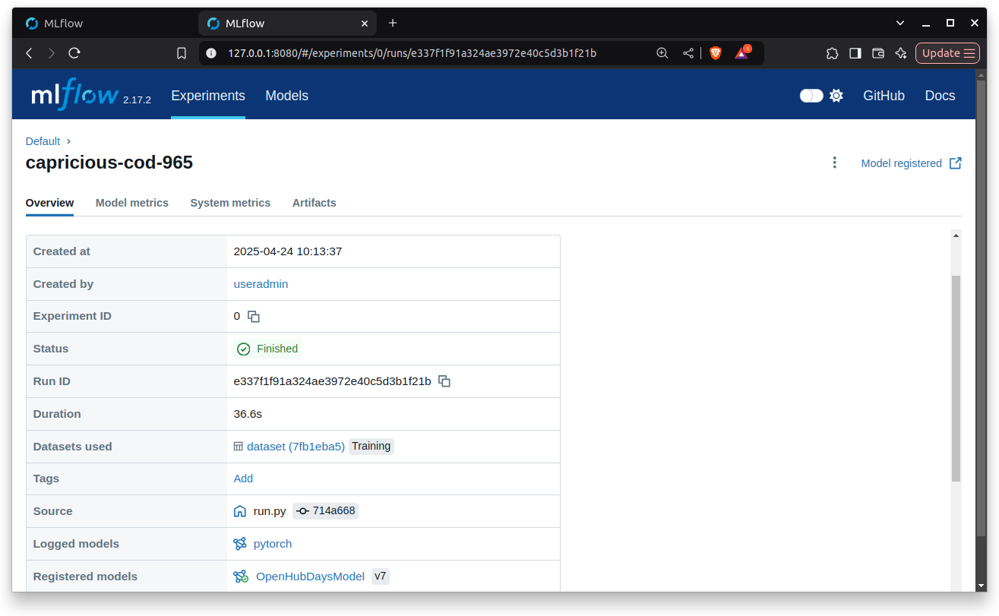
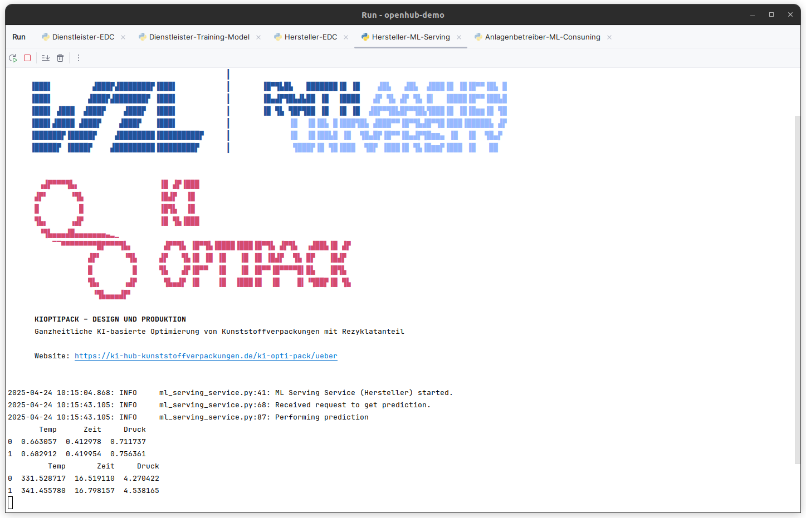

# Running the demonstrator


Running the demonstrator is a bit complicated, due to its distributed nature and the use of different technologies.
Please make sure to have the following software installed on your machine:
- Docker (for example [Docker Desktop](https://www.docker.com/products/docker-desktop))
- MongoDB (for example [MongoDB Community Edition](https://www.mongodb.com/try/download/community))
- Python 3.9 or higher (for example [Anaconda](https://www.anaconda.com/products/distribution))

For Troubleshooting, you can check out this [setup video](https://youtu.be/WxKDhfsslRw)
of a similar technology stack.

## Setting up MongoDB
The demonstrator uses MongoDB as a database to store the data. 
FastIoT's MongoDB connector is required to connect the MongoDB database using a username and password.
It is not possible to connect to the database without a username and password (even though when you can access it without password protection in the MongoDB shell or MongoDB Explorer).
To set up the MongoDB database, please follow these steps:

1. make sure MongoDB is running on your machine. You can check this by running the following command in the terminal:
```bash
sudo systemctl status mongod
```
If MongoDB is not running, you can start it by running the following command

```bash
 sudo systemctl start mongod
 ```

2. Create username and password in the mongo shell:

```bash
 use admin
```
```bash
 db.createUser({ user: "fiot", pwd: "fiotdev123", roles: [ { role: "root", db: "admin" } ] })
```

This username and password is used this repository to connect to the MongoDB database. If you want to use a different username and password, you need to change the corresponding Microservice.

## Clone the repository
First, clone the repository to your local machine. You can do this by running the following command in your terminal:
```bash
git clone https://github.com/Alexander-Nasuta/openhub-demo.git
```

## Create a Virtual Environment (optional)

Most Developers use a virtual environment to manage the dependencies of their projects.
I personally use `conda` for this purpose.

When using `conda`, you can create a new environment with the name 'openhub-demo' following command:

```shell
conda create -n openhub-demo python=3.11
```

Feel free to use any other name for the environment or a more recent version of python.
Activate the environment with the following command:

```shell
conda activate openhub-demo
```

Replace `openhub-demo` with the name of your environment, if you used a different name.

You can also use `venv` or `virtualenv` to create a virtual environment. In that case please refer to the respective documentation.


## Install the dependencies
Next, you need to install the dependencies for each Dataspace Participant (FastIOT Project).

```bash
pip install -r ./anlagenbetreiber/requirements.txt
```
```bash
pip install -r ./dienstleister/requirements.txt
```
```bash
pip install -r ./hersteller/requirements.txt
```

## Create FastIoT configuration
Next create the FastIoT configuration for each Dataspace Participant (FastIOT Project).
```bash
cd ./anlagenbetreiber
```
```bash
fiot create config
```
```bash
cd ../dienstleister
```
```bash
fiot create config
```
```bash
cd ../hersteller
```
```bash
fiot create config
```


## Starting the Nats Broker

The simplest way to start the Nats Broker is to use FastIoTs integration_test deployment.
```bash
cd ./anlagenbetreiber
```
```bash
fiot start integration_test
```

## Starting MLflow
The MLflow server is used to manage the machine learning lifecycle, including experimentation, reproducibility, and deployment.
To start the MLflow server, run the following command in your terminal:

```bash
mlflow server --host 127.0.0.1 --port 8080
```

## Starting the Microservices
The Microservices can be started by running the `run.py` script in each directory.
So for example for starting the MongoDB Database Service `machinen_parametrierung_service.py` run the script `./anlagenbetreiber/src/anlagenbetreiber_services/machinen_parametrierung/run.py`

The Services depend on each other, so to avoid warning and error messages, please run the services in the following order:

0. (make sure the Nats Broker, MongoDB, Docker, MLflow are running)
1. MongoDB Service (`mongo_database` in `./anlagenbetreiber/src/anlagenbetreiber_services`)
2. Dataspace Connector Service (Machine Operator) (`edc_anlagenbetreiber` in `./anlagenbetreiber/src/edc_anlagenbetreiber`)
3. Data Processing Service (`data_processing` in `./dienstleister/src/dienstleister_services`)
4. Dataspace Connector Service (ML Service Provider) (`edc_dienstleister` in `./anlagenbetreiber/src/anlagenbetreiber_services`)
5. ML Model Training Service (`ml_training` in `./dienstleister/src/dienstleister_services`)
6. ML Serving Service (`ml_serving` in `./hersteller/src/hersteller_services`)
7. Dataspace Connector Service (Machine Manufacturer) (`edc_hersteller` in `./hersteller/src/hersteller_services`)
8. Prediction Consuming Service (`machinen_parametrierung` in `./anlagenbetreiber/src/anlagenbetreiber_services`)

## Expected Output
Here are some Screenshots and Videos of the running System

### Database
In MongoExplorer you can see the data that is stored in the MongoDB database.


### MLFlow
Over time you should see a bunch of runs in MLflow in the Experiments tab.


The detailed view of a run looks like this:




The trained models will appear in the Models tab.


### Console logs

Below you can find the console logs of the Model Hosting Service with two example predictions.



In this Video you can see some console logs of the running system.

Video on Youtube:

[](https://www.youtube.com/watch?v=CP15-dN5qjQ)


Video on Github:
[Watch Video: Screencast.webm](../../resources/Screencast.webm)